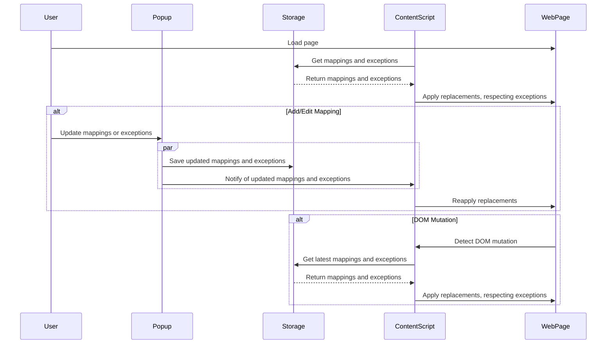

# Word/Phrase Replacer Extension

A browser extension that replaces specified words or phrases with alternatives, with support for exceptions.

## Installation

1. Clone the repository.
2. Open `chrome://extensions/` (or `edge://extensions`, `brave://extensions`, etc.).
3. Enable **Developer mode**.
4. Click **Load unpacked**.
5. Select the extension directory.

> **Note:** This extension is compatible with Chromium-based browsers such as Chrome, Edge, Brave, and Opera.


## Architecture

The extension consists of three main components:

### 1. Popup (UI)
- **Files**: `popup.html`, `popup.js`
- **Purpose**: Provides the user interface for managing word replacements.
- **Features**:
  - Add/remove word mappings.
  - Add/remove exceptions.

### 2. Content Script
- **File**: `content.js`
- **Purpose**: Performs the actual text replacements on web pages.
- **Key Features**:
  - Uses XPath to efficiently find text nodes.
  - Applies replacements while honoring exceptions.
  - Observes DOM mutations to handle dynamic content updates.
  - Preserves case sensitivity and word boundaries.

### 3. Storage
- Uses Chrome's Storage API (`chrome.storage.local`).
- Stores mappings and exceptions persistently across browser sessions.
- Ensures updates in the popup are immediately available to the content script.


## Data Flow

### Overview
1. **Initial Load**:
   - The content script loads with each page.
   - Retrieves mappings and exceptions from storage.
   - Applies replacements to the page content.

2. **User Updates Mappings**:
   - The user updates mappings or exceptions in the popup.
   - The popup saves updates to storage and notifies the content script.
   - The content script reapplies replacements to the page, respecting exceptions.

3. **Dynamic Content**:
   - The `MutationObserver` in the content script detects changes to the DOM.
   - Replacements are reapplied to newly added content.


### Sequence Diagram



## Exception Handling

The extension uses two separate lists to manage replacements:

1. **Word Mappings**: Key-value pairs of words/phrases to be replaced.

2. **Exceptions**: List of phrases that should never be replaced.

### How Overlaps Are Detected

1. **Locate Matches**:

   - The script identifies the start and end positions of all exceptions in the text.
   - Separately, it finds the start and end positions of words/phrases to be replaced.

2. **Compare Positions**:
   - For each replacement, compare its range with the ranges of all exceptions.
   - A replacement overlaps an exception if:
     - Its **start position** falls within the exception range.
     - Its **end position** falls within the exception range.
     - Any part of the replacement overlaps the exception range.

#### Example:
**Text**: `"John Smith went to the park."`  
**Replacement**: `"Smith"` → `"Jones"`  
**Exception**: `"John Smith"`  

- Exception `"John Smith"`: Start = 0, End = 10

- Replacement `"Smith"`: Start = 5, End = 10

- Overlap detected → Skip replacing `"Smith"`.


### Mechanism for Skipping Overlaps

1. **Find All Matches**:
   - Use regular expressions to identify replacements and exceptions.
   - Record their positions in the text.

2. **Check for Overlaps**:
   - For each replacement, determine if it overlaps with any exception:
     ```javascript
     const overlapsException = matches.some(m => 
       m.isException && 
       (
         // Start of replacement falls within exception
         (match.index >= m.start && match.index < m.end) || 
         // End of replacement falls within exception
         (match.index + match[0].length > m.start && 
          match.index + match[0].length <= m.end)
       )
     );
     ```

3. **Apply Replacements**:
   - Skip replacements that overlap with exceptions.
   - Apply all non-overlapping replacements.

#### Example:
**Input**:  
- **Mappings**: `{ "Smith": "Jones" }`  
- **Exceptions**: `[ "John Smith" ]`  
- **Text**: `"John Smith and Mary Smith are here."`

**Output**:  
- `"John Smith and Mary Jones are here."`


## Technologies Used

- **Manifest V3**: Ensures compatibility with modern browser extension standards.
- **Chrome Storage API**: Provides persistent storage for mappings and exceptions.
- **MutationObserver**: Efficiently detects and handles dynamic content changes.
- **XPath**: Optimized for locating text nodes in the DOM.

> **Why XPath?**
> XPath efficiently navigates the DOM to locate text nodes while avoiding irrelevant elements (e.g., `<script>` or `<style>`).


